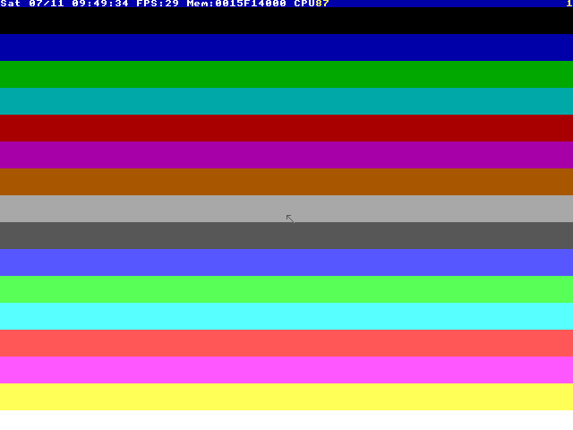

# holytoy

**Shadertoy, but it's TempleOS.**

Live-code per-pixel graphics in [HolyC](https://templeos.org), running on
real TempleOS in QEMU. Save a file on Linux; ~20 seconds later you have a
screenshot of what the Temple drew — or a live window, if you want to
watch it move.



*`src/gradient.HC`, 15 lines of HolyC, captured straight from the VM by
`make run`.*

## Why

TempleOS is a 64-bit, ring-0-only OS with a compiler that JITs code into
the kernel *as you type it*, a 640×480×16-color VGA canvas, and a
per-frame `draw_it` callback — it is, accidentally, a demoscene machine
with native live-reload. holytoy turns that into a modern dev loop:

- **Edit on Linux, run on TempleOS** — file injection over a FAT32
  transfer disk, zero clicking in the VM.
- **Fast, honest feedback** — screenshot + guest logs + real exit codes.
  TempleOS compiler errors land in your terminal, file and line included.
- **Unbreakable** — the installed OS image is read-only; every run boots
  a throwaway copy-on-write overlay. `make golden` rebuilds the whole OS
  from the ISO, unattended, in about a minute.

The destination is more ambitious: **a Shadertoy clone running inside
TempleOS** — GLSL input box + live viewport, with GLSL compiled to HolyC
inside the app, plus lookup-table math and palette-cycling tricks. That's
the v1 spec, laid out in [docs/VISION.md](docs/VISION.md).

## Quickstart

Needs: `qemu-system-x86_64`, `mtools`, `python3`, `ffmpeg`, `make`.
No root, no KVM required (used automatically if present).

```sh
make fetch-iso    # grab TempleOS 5.03 from templeos.org (~17 MB)
make golden       # install TempleOS into images/golden.qcow2, unattended
make test         # prove the loop end-to-end (10 VM tests)

make run SRC=src/gradient.HC     # one cycle -> prints an isolated RUN_DIR
make run SRC=tests/glsl/live-gradient.glsl # GLSL compiled inside HolyToy
make watch SRC=src/gradient.HC   # re-run on every save
make gui SRC=src/gradient.HC     # live QEMU window, toy auto-runs
```

Your first toy is a `draw_it` callback — called every frame by the
TempleOS window manager:

```holyc
U0 DrawIt(CTask *,CDC *dc)
{
  I64 y,h=Fs->pix_height,w=Fs->pix_width;
  for (y=0;y<h;y++) {
    dc->color=y*COLORS_NUM/h;
    GrLine(dc,0,y,w-1,y);
  }
}
Fs->draw_it=&DrawIt;
```

No `main`, no boilerplate — HolyC executes top to bottom, JIT-compiled
inside the OS. Mind that sources must be plain ASCII (TempleOS predates
UTF-8, gloriously).

## How it works, in one breath

`make run` copies your source onto a FAT32 disk image with mtools, boots
a fresh overlay of the golden TempleOS image headless, where a tiny boot
hook mounts the disk and executes your code under `try/catch`; the guest
writes status and logs back to the disk, holds the picture for the
screenshot, and reboots — which, with `-no-reboot`, is how the VM says
"done". The command prints the run directory containing `latest.png`, logs,
frames, and its transfer disk. The harness even OCRs the screen (TempleOS's
fixed 8×8 kernel font makes it pixel-exact) so tools — and AI agents — can
*read* the Temple in that run's `screen.txt`.

Everything operational — exit codes, artifact paths, guest-side rules,
troubleshooting, golden-image surgery — lives in
[AGENTS.md](AGENTS.md).

## Proven by `make test`

A host-only preflight first proves allocation/pruning atomicity, isolates
individual deletion failures, and checks the corpus compatibility tooling.
Then ten real TempleOS VM proofs run:

1. a marker string round-trips host → guest → host;
2. the gradient renders at 640×480 with 16 colors, screenshot verified;
3. a deliberate syntax error surfaces the TempleOS compiler message on
   the host with a nonzero exit;
4. animated plasma produces distinct trailing frames and a GIF;
5. two simultaneous VMs retain isolated markers, disks, and slot numbers;
6. the HolyToy app hot-swaps shaders live, survives a bad compile with
   the previous shader still animating, passes its fixed-point math
   check, and shows a per-frame shading-time readout on screen;
7. a `.glsl` file handed to the runner compiles inside the guest and
   animates in the app viewport;
8. a host-injected mouse move lands on a target pixel (±16) and the
   guest observes the click;
9. a static GLSL gradient has deterministic viewport pixels, spatially
   varying ordered dithering, and a sane 16-color gamut;
10. raw GLSL compiles in the guest and renders through the app renderer.

## Credits

- Terry A. Davis — TempleOS, public domain.
- [cia-foundation/TempleOS](https://github.com/cia-foundation/TempleOS) —
  the archived source tree this project reads for ground truth
  (vendored in `vendor/`).
