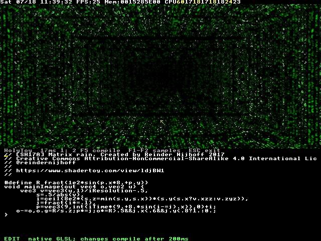
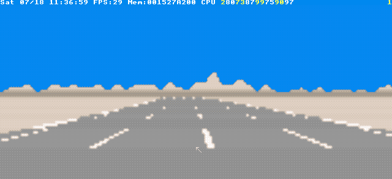
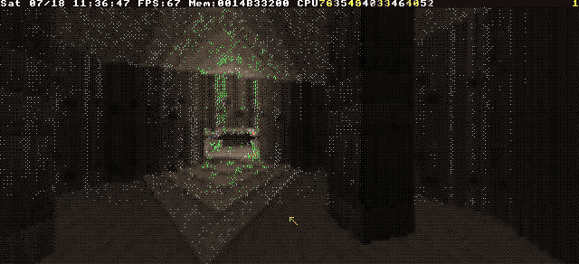

# holytoy

**Shadertoy, but it's TempleOS.**



*That is [\[SH17A\] Matrix rain](https://www.shadertoy.com/view/ldjBW1) by
[Reinder Nijhoff](https://www.shadertoy.com/user/reinder)
([CC BY-NC-SA 4.0](https://creativecommons.org/licenses/by-nc-sa/4.0/)) —
unmodified GLSL from Shadertoy, compiled to HolyC **by a compiler that runs
inside TempleOS**, JIT-ted into the kernel, and rendered live at
640×480 in 16 colors. The whole shader is sitting in the editor pane below
the viewport. Nothing here is mocked: that's a real TempleOS status bar on
top, real frame times on the left, and a real `EDIT` prompt at the bottom
waiting for you to break something.*

## What

HolyToy is a [Shadertoy](https://www.shadertoy.com) clone that runs *inside*
TempleOS: a code pane + live viewport. You type GLSL —
`mainImage(fragColor, fragCoord)`, `iTime`, `iResolution`, `iMouse`,
`iFrame`, the whole convention — and ~200 ms after you stop typing, an
embedded GLSL→HolyC compiler (written in HolyC, of course) rebuilds your
shader and the viewport picks it up mid-animation. A compile error never
kills the app; the previous shader keeps animating while the message points
at your typo.

This repo is that app, plus the modern dev loop wrapped around it: edit a
`.glsl` file on Linux, and ~20 seconds later a throwaway TempleOS VM has
booted, compiled your shader **in the guest**, animated it, and left you a
screenshot, frames, a GIF, logs, and an honest exit code.

The canonical Shadertoy "new shader" template runs unmodified — save it as
`rainbow.glsl` and:

```glsl
void mainImage( out vec4 fragColor, in vec2 fragCoord )
{
    vec2 uv = fragCoord/iResolution.xy;
    vec3 col = 0.5 + 0.5*cos(iTime+uv.xyx+vec3(0,2,4));
    fragColor = vec4(col,1.0);
}
```

```sh
make run SRC=rainbow.glsl    # headless: screenshot + GIF + logs
make gui SRC=rainbow.glsl    # live QEMU window, edit inside TempleOS
```

## Why

TempleOS is a 64-bit, ring-0-only OS with a compiler that JITs code into
the kernel *as you type it*, a 640×480×16-color VGA canvas, and a
per-frame `draw_it` callback — it is, accidentally, a demoscene machine
with native live-reload. Terry Davis built the perfect shader toy host; he
just didn't ship the shader toy. This is that.

## Getting the shaders to actually run

GLSL assumes float32 hardware and sixteen million colors. TempleOS offers
neither, so holytoy carries its own rendering stack:

- **A real GLSL compiler in HolyC** — lexer, preprocessor, parser,
  lowering, emitter: ~5,600 lines living in the guest, plus ~3,200 more of
  math library, renderer, and app. Your shader becomes HolyC source that
  TempleOS's own JIT compiles in milliseconds.
- **Faithful float32** — arithmetic is emitted through x87 in
  single-precision mode (~2.4 ns/op), reproducing IEEE float32 semantics,
  so a shader picks the *same colors* here as under a desktop OpenGL
  renderer — verified pixel-by-pixel against one.
- **All cores shade** — the window manager keeps core 0; shader bands fan
  out across the other cores into a double buffer. A slow shader can never
  freeze the editor.
- **Adaptive resolution** — a controller walks shade scale between 1:16
  and 1:1 chasing interactive frame rates, with center-aligned bilinear
  upsampling; pin it with `HOLYTOY_SCALE=1..16`.
- **16 colors, spent wisely** — ordered (Bayer) dithering plus a
  scene-adaptive palette: every few frames the app histograms what the
  shader *wants* to draw and reprograms the sixteen VGA palette registers
  to match. Frame-time telemetry sits in the status line, so slow is
  visible, never mysterious.

Does it work? There's a versioned corpus of **51 real Shadertoy shaders**
(pinned, licensed, provenance-recorded) in `corpus/`. All 39 texture-free
ones compile and render in the guest; 32 of those match the desktop
OpenGL reference within the visual oracle's tolerance — path tracers,
raymarched cities in the rain, Doom E1M1 — on an OS with no GPU driver, no
floats in its palette, and no idea what a texture is.

|  |  |
|:--:|:--:|
| [Outrun](https://www.shadertoy.com/view/Mdf3Dr) | [Doom 2](https://www.shadertoy.com/view/lsB3zD) |

*Both by Reinder Nijhoff (CC BY-NC-SA 4.0), rendered by TempleOS.*

## Quickstart

Needs: `qemu-system-x86_64`, `mtools`, `python3`, `ffmpeg`, `make`.
No root. KVM is used if present, not required.

```sh
make fetch-iso    # grab TempleOS 5.03 from templeos.org (~17 MB)
make golden       # install TempleOS into images/golden.qcow2, unattended
make test         # prove the whole loop: 17 proofs through real VMs

make run SRC=tests/glsl/plasma.glsl   # one cycle -> isolated run dir
make watch SRC=my-toy.glsl            # re-run on every save
make gui SRC=my-toy.glsl              # live window; edit in TempleOS itself
```

Every run prints its own `RUN_DIR` containing `latest.png`, `anim.gif`,
`frames/`, guest logs, and the transfer disk. Runs are isolated; three can
fly in parallel.

Prefer raw HolyC over GLSL? The harness runs `.HC` files too — your first
toy is a `draw_it` callback and the OS calls it every frame:

```holyc
U0 DrawIt(CTask *,CDC *dc)
{
  I64 y,h=Fs->pix_height,w=Fs->pix_width;
  for (y=0;y<h;y++) {
    dc->color=y*COLORS_NUM/h;
    GrLine(dc,0,y,w-1,y);
  }
}
Fs->draw_it=&DrawIt;
```

No `main`, no boilerplate — HolyC executes top to bottom. Sources must be
plain ASCII (TempleOS predates UTF-8, gloriously).

## How it works, in one breath

`make run` copies your source onto a FAT32 disk image with mtools, boots a
fresh copy-on-write overlay of the golden TempleOS image headless, where a
tiny boot hook mounts the disk and executes your code under `try/catch`;
the guest writes status and logs back to the disk, holds the picture for
the screenshot, and reboots — which, with `-no-reboot`, is how the VM says
"done". TempleOS compiler errors land in your terminal, file and line
included. The harness even OCRs the screen (TempleOS's fixed 8×8 kernel
font makes it pixel-exact), so scripts — and AI agents — can *read* the
Temple in each run's `screen.txt`.

The installed OS image is read-only; every run boots a throwaway overlay.
`make golden` rebuilds the whole OS from the ISO, unattended, in about a
minute. You cannot brick it, and not for lack of trying.

Everything operational — exit codes, artifact paths, guest-side rules,
troubleshooting, golden-image surgery — lives in [AGENTS.md](AGENTS.md).

## Proven by `make test`

Seventeen proofs, every one through a real TempleOS VM — no mocks, the
screenshots are the assertions. Highlights: a deliberate syntax error must
surface the TempleOS compiler message on the host with a nonzero exit; the
app must survive a bad recompile with the previous shader still animating;
a host-injected mouse move must land on a target pixel and be observed by
the guest; single-core and 8-core renders must be byte-identical; a
1:16-scale bilinear upsample of a linear shader must equal its 1:1 render
exactly; and QMP must drive the native TempleOS editor, debounce-compile,
and change the viewport before the editor exits.

<details>
<summary>All seventeen</summary>

1. **smoke** — a marker string round-trips host → guest → host
2. **gradient** — 640×480, 16 colors, screenshot-verified
3. **error** — guest compiler failure surfaces as exit 1 with the message
4. **animate** — plasma produces distinct trailing frames and a GIF
5. **parallel** — simultaneous VMs keep disks, markers, slots isolated
6. **holytoy** — live recompile self-test, fixed-point math check,
   per-frame shading-time readout
7. **glsl-app** — a `.glsl` file compiles in-guest and animates in the app
8. **mouse** — QMP mouse injection lands on a pixel (±16) and clicks
9. **dither** — static GLSL gradient is deterministic and spatially
   dithered with a sane 16-color gamut
10. **guest-glsl** — raw GLSL renders through the app renderer
11. **circle** — declarations, vectors, swizzles, constructors, `length`,
    `step` compile and render centered geometry
12. **editor** — native in-guest editing auto-compiles; viewport changes
13. **oracle** — guest visual sample dump matches the committed reference
14. **smp** — single-core vs multicore render is byte-identical
15. **sse** — SSE stage-0 probe: enable, execute, XMM survival
16. **bilerp** — 1:16 bilinear upsample of a linear shader equals 1:1
17. **pal** — adaptive palette is deterministic, converges, gates off

</details>

## Credits

- Terry A. Davis — TempleOS, public domain. An operating system one person
  wrote, including the compiler this project leans on.
- [cia-foundation/TempleOS](https://github.com/cia-foundation/TempleOS) —
  the archived source tree read for ground truth (vendored in `vendor/`).
- [Reinder Nijhoff](https://reindernijhoff.net/) and
  [bean_mhm](https://www.shadertoy.com/user/beans_please) — authors of the
  corpus shaders, preserved from their own backups with licenses and
  provenance recorded per shader (see `corpus/shadertoy/v2/README.md`).
  The demo GIF and gallery stills above are derivatives of CC BY-NC-SA 4.0
  shaders and carry the same license.
- [Shadertoy](https://www.shadertoy.com) — the original, obviously.

## License

[MIT](LICENSE) for everything holytoy: the in-guest compiler and app, the
harness, and the tools. Exceptions keep their own terms: the vendored
TempleOS sources are public domain, and each corpus shader carries its
recorded upstream license (CC BY-NC-SA 4.0 or AGPL-3.0 — see
`corpus/shadertoy/v2/README.md`), which the demo images inherit.
